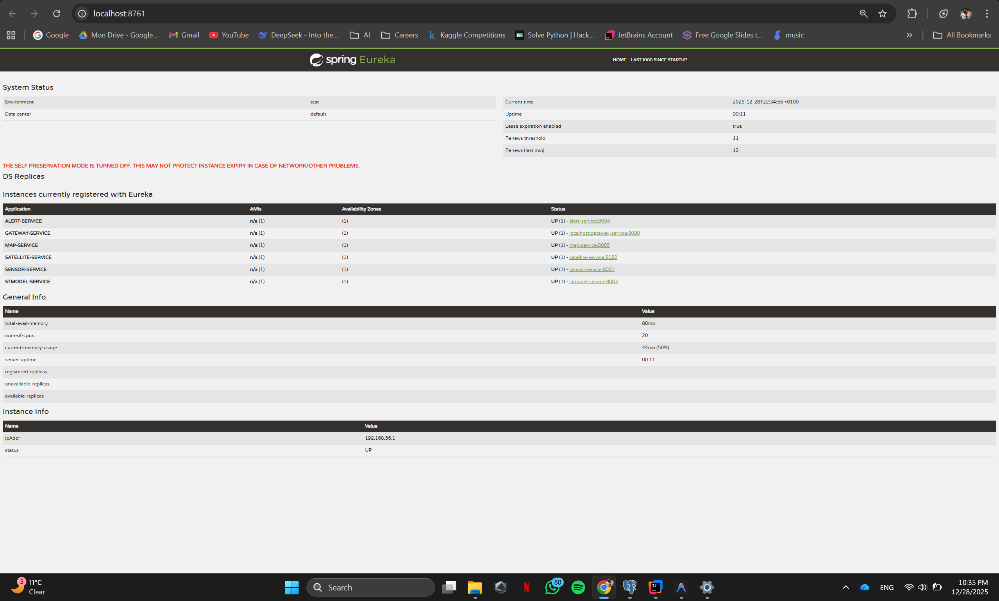

# 🌊 AquaWatch - Plateforme de Surveillance de la Qualité de l'Eau

[](https://github.com/iMaDissame/AquaWatch_ArchitectureMS/actions/workflows/ci.yml)
[](https://sonarcloud.io/summary/new_code?id=iMaDissame_AquaWatch_ArchitectureMS)

> **Une plateforme de surveillance en temps réel de la qualité de l'eau basée sur une architecture microservices**

---

## 📋 Table des Matières

- [Démo Vidéo](#-démo-vidéo)
- [Architecture Globale](#-architecture-globale)
- [BPMN - Processus Métier](#-bpmn---processus-métier)
- [Service Discovery (Eureka)](#-service-discovery-eureka)
- [Microservices](#-microservices)
- [Stack Technologique](#-stack-technologique)
- [Tests et Qualité du Code](#-tests-et-qualité-du-code)
- [CI/CD Pipeline](#-cicd-pipeline)
- [Installation](#-installation)

---

## 🎬 Démo Vidéo

> **Regardez la démonstration complète de l'application AquaWatch**

[](https://drive.google.com/file/d/13l916RqiVfixDqiGkdN0d51MmVEOosi_/view?usp=sharing)

---

## 🏗️ Architecture Globale

L'architecture d'AquaWatch est basée sur une approche **microservices** avec les composants suivants :


### Composants Principaux :

| Composant | Description |
|-----------|-------------|
| **API Gateway** | Point d'entrée unique pour toutes les requêtes |
| **Discovery Service** | Registre des services (Eureka Server) |
| **Sensor Service** | Gestion des stations et mesures capteurs |
| **Satellite Service** | Intégration des données satellites |
| **STModel Service** | Calcul de l'indice de qualité de l'eau (WQI) |
| **Alert Service** | Génération et gestion des alertes |
| **Map Service** | Service cartographique |
| **Frontend Angular** | Interface utilisateur moderne |

---

## 📊 BPMN - Processus Métier

Le diagramme BPMN ci-dessous illustre le flux de données et les processus métier de la plateforme :


### Flux de Traitement :
1. **Acquisition** → Collecte des données capteurs et satellites
2. **Traitement** → Calcul du Water Quality Index (WQI)
3. **Analyse** → Évaluation de la qualité (GOOD/MODERATE/BAD)
4. **Alerte** → Génération automatique des alertes si nécessaire
5. **Visualisation** → Dashboard temps réel

---

## 🔍 Service Discovery (Eureka)

Netflix Eureka assure la découverte et l'enregistrement dynamique des services :



### Services enregistrés :
- ✅ `ALERT-SERVICE`
- ✅ `SENSOR-SERVICE`
- ✅ `SATELLITE-SERVICE`
- ✅ `STMODEL-SERVICE`
- ✅ `MAP-SERVICE`
- ✅ `GATEWAY-SERVICE`

---

## 🧩 Microservices

```
AquaWatch_ArchitectureMS/
├── 📦 discovery-service/     # Eureka Server (Port 8761)
├── 📦 gateway-service/       # API Gateway (Port 8080)
├── 📦 sensor-service/        # Gestion capteurs (Port 8081)
├── 📦 satellite-service/     # Données satellites (Port 8082)
├── 📦 stmodel-service/       # Calcul WQI (Port 8083)
├── 📦 alert-service/         # Gestion alertes (Port 8084)
├── 📦 map-service/           # Service carte (Port 8085)
└── 🅰️ aquawatch-frontend/    # Angular App (Port 4200)
```

---

## 🛠️ Stack Technologique

| Catégorie | Technologies |
|-----------|--------------|
| **Backend** | Java 17, Spring Boot 3.2, Spring Cloud |
| **Frontend** | Angular 17, TypeScript |
| **Base de données** | PostgreSQL, H2 (tests) |
| **Service Discovery** | Netflix Eureka |
| **API Gateway** | Spring Cloud Gateway |
| **Tests** | JUnit 5, Mockito, AssertJ |
| **Couverture** | JaCoCo |
| **Qualité Code** | SonarCloud |
| **CI/CD** | GitHub Actions |
| **Conteneurisation** | Docker, Docker Compose |

---

## ✅ Tests et Qualité du Code

### Tests Unitaires

| Service | Tests | Couverture |
|---------|-------|------------|
| Alert Service | 16 tests ✅ | Coverage calculé par JaCoCo |
| Sensor Service | 10 tests ✅ | Coverage calculé par JaCoCo |
| STModel Service | 10 tests ✅ | Coverage calculé par JaCoCo |

Exemple Alert Service :


### SonarCloud Analysis


---

## 🔄 CI/CD Pipeline

Le pipeline GitHub Actions automatise :

1. **Build** → Compilation de chaque microservice
2. **Test** → Exécution des tests unitaires
3. **Coverage** → Génération des rapports JaCoCo
4. **Analysis** → Analyse SonarCloud
5. **Report** → Résumé du build

### Pipeline Screenshots

Capture 1: 


Capture 2:


---

## 🚀 Installation

### Prérequis

- Java 17+
- Maven 3.8+
- Node.js 18+ (pour le frontend)
- Docker & Docker Compose (optionnel)

### Démarrage Rapide

```bash
# 1. Cloner le repository
git clone https://github.com/iMaDissame/AquaWatch_ArchitectureMS.git
cd AquaWatch_ArchitectureMS

# 2. Démarrer Discovery Service
cd discovery-service
./mvnw spring-boot:run

# 3. Démarrer les autres services (dans des terminaux séparés)
cd gateway-service && ./mvnw spring-boot:run
cd sensor-service && ./mvnw spring-boot:run
cd satellite-service && ./mvnw spring-boot:run
cd stmodel-service && ./mvnw spring-boot:run
cd alert-service && ./mvnw spring-boot:run
cd map-service && ./mvnw spring-boot:run

# 4. Démarrer le frontend
cd aquawatch-frontend
npm install
ng serve
```

### Exécuter les Tests

```bash
# Tester un service spécifique
cd alert-service
./mvnw test

# Générer le rapport de couverture
./mvnw jacoco:report
# Rapport disponible dans: target/site/jacoco/index.html
```

---

## 👥 Équipe

Ce projet a été développé par :

| Membre | GitHub |
|--------|--------|
| **ISSAME Imad** | [](https://github.com/iMaDissame) |
| **AGOUMI Mohammed Amine** | [](https://github.com/aminegumi) |
| **JABRANE Mohamed Yahya** | [](https://github.com/yahya-x) |
