<div align="center"><a name="readme-top"></a>

[](#)

# 🌊 Water Quality Testing Data Analysis<br/><h3>Advanced Analytics Toolkit for Environmental Monitoring</h3>

A comprehensive data science toolkit for analyzing water quality parameters, performing statistical analysis, and building predictive models.<br/>
Supports exploratory data analysis, correlation studies, and machine learning-based water quality assessment.<br/>
Professional-grade **water quality monitoring** solution for researchers and environmental scientists.

[Live Demo][demo-link] · [Documentation][docs-link] · [Dataset][dataset-link] · [Issues][github-issues-link]

<br/>

[][jupyter-link]

<br/>

<!-- SHIELD GROUP -->

[![][github-release-shield]][github-release-link]
[![][python-shield]][python-link]
[![][jupyter-shield]][jupyter-link]
[![][pandas-shield]][pandas-link]<br/>
[![][license-shield]][license-link]
[![][github-contributors-shield]][github-contributors-link]
[![][github-forks-shield]][github-forks-link]
[![][github-stars-shield]][github-stars-link]
[![][github-issues-shield]][github-issues-link]<br>
[![][sponsor-shield]][sponsor-link]

**Share Water Quality Research**

[![][share-x-shield]][share-x-link]
[![][share-telegram-shield]][share-telegram-link]
[![][share-whatsapp-shield]][share-whatsapp-link]
[![][share-reddit-shield]][share-reddit-link]
[![][share-linkedin-shield]][share-linkedin-link]

<sup>🌊 Advancing water quality monitoring through data science. Built for environmental research and monitoring.</sup>

</div>

> [!TIP]
> This project demonstrates advanced data analysis techniques for environmental monitoring, combining statistical analysis with machine learning for water quality assessment.

## 📊 Dataset Overview

Our comprehensive water quality dataset contains **500 samples** with 6 key parameters:

| Parameter | Range | Unit | Description |
|-----------|--------|------|-------------|
| **pH** | 6.83 - 7.48 | pH units | Acidity/alkalinity measure |
| **Temperature** | 20.3 - 23.6 | °C | Water temperature |
| **Turbidity** | 3.1 - 5.1 | NTU | Water clarity measure |
| **Dissolved Oxygen** | 6.0 - 9.9 | mg/L | Oxygen content in water |
| **Conductivity** | 316 - 370 | µS/cm | Electrical conductivity |

> [!NOTE]
> All parameters are within acceptable ranges for most water quality standards, making this dataset ideal for correlation and predictive modeling studies.

<details>
<summary><kbd>📈 Statistical Summary</kbd></summary>

```
Statistical Summary of Water Quality Parameters:
                     pH  Temperature (°C)  Turbidity (NTU)  Dissolved Oxygen (mg/L)  Conductivity (µS/cm)
count        500.000000        500.000000        500.000000               500.000000            500.000000
mean           7.161140         22.054400          4.169400                 8.382200            344.362000
std            0.107531          0.903123          0.397492                 0.822396             13.038672
min            6.830000         20.300000          3.100000                 6.000000            316.000000
25%            7.080000         21.200000          3.800000                 7.800000            333.000000
50%            7.160000         22.200000          4.200000                 8.400000            344.000000
75%            7.250000         22.900000          4.500000                 9.100000            355.000000
max            7.480000         23.600000          5.100000                 9.900000            370.000000
```

</details>

## ✨ Key Features

### `1` 📊 **Comprehensive Data Analysis**

Advanced statistical analysis capabilities including descriptive statistics, correlation analysis, and data quality assessment.

**Core Analytics:**
- 📈 **Statistical Summaries**: Complete descriptive statistics for all parameters
- 🔍 **Data Quality Assessment**: Missing value detection and data type analysis
- 📊 **Distribution Analysis**: Understanding parameter distributions and outliers
- 🎯 **Correlation Studies**: Strong correlation discovered (r=0.705) between pH and dissolved oxygen

### `2` 🎨 **Rich Data Visualization**

Professional-grade visualizations for water quality parameter analysis and reporting.

**Visualization Suite:**
- 📊 **Distribution Plots**: Histograms with KDE curves for parameter distributions
- 🔗 **Correlation Matrices**: Heatmaps showing parameter relationships
- 📈 **Scatter Plots**: Relationship analysis with trend lines
- 🎭 **Pair Plots**: Comprehensive multi-parameter visualization
- 📉 **Regression Plots**: Linear relationship visualization with confidence intervals

### `3` 🤖 **Predictive Modeling**

Machine learning models for water quality parameter prediction and assessment.

**ML Capabilities:**
- 🎯 **Linear Regression**: Predict conductivity using multiple parameters
- 📊 **Statistical Modeling**: OLS regression with detailed statistical summaries
- 🔮 **Parameter Prediction**: Multi-feature models for water quality forecasting
- 📈 **Model Evaluation**: Comprehensive model performance assessment

### `*` Additional Features

- [x] 🐍 **Python-Powered**: Built with pandas, scikit-learn, and seaborn
- [x] 📓 **Jupyter Integration**: Interactive analysis environment
- [x] 📊 **Statistical Analysis**: Advanced statistical modeling with statsmodels
- [x] 🎨 **Professional Plots**: Publication-ready visualizations
- [x] 🔍 **Exploratory Data Analysis**: Comprehensive EDA workflow
- [x] 📈 **Trend Analysis**: Time-series and parameter trend identification
- [x] 📋 **Automated Reports**: Structured analysis output
- [x] 🔬 **Research-Ready**: Suitable for academic and professional research

<div align="right">

[![][back-to-top]](#readme-top)

</div>

## 🛠️ Tech Stack

<div align="center">
  <table>
    <tr>
      <td align="center" width="96">
        
        <br>Python 3.x
      </td>
      <td align="center" width="96">
        
        <br>Pandas
      </td>
      <td align="center" width="96">
        
        <br>NumPy
      </td>
      <td align="center" width="96">
        
        <br>Scikit-learn
      </td>
      <td align="center" width="96">
        
        <br>Matplotlib
      </td>
      <td align="center" width="96">
        
        <br>Jupyter
      </td>
    </tr>
  </table>
</div>

**Core Libraries:**
- **Python 3.x**: Main programming language
- **Pandas**: Data manipulation and analysis
- **NumPy**: Numerical computing foundation
- **Matplotlib**: Static plotting and visualization
- **Seaborn**: Statistical data visualization

**Advanced Analytics:**
- **Scikit-learn**: Machine learning algorithms
- **Statsmodels**: Statistical modeling and testing
- **Plotly**: Interactive visualizations
- **Jupyter**: Interactive development environment

**Visualization Stack:**
- **Seaborn**: Statistical plotting with beautiful defaults
- **Matplotlib**: Publication-quality figures
- **Plotly**: Interactive and dynamic charts

## 🏗️ Analysis Workflow

### Data Analysis Pipeline


### Key Findings

```mermaid
graph LR
    subgraph "Parameter Relationships"
        A[pH: 7.16 ± 0.11] --> B[Strong Correlation]
        B --> C[Dissolved O₂: 8.38 ± 0.82]
        D[Temperature: 22.1 ± 0.9°C] --> E[Weak Correlation]
        E --> F[Conductivity: 344 ± 13 µS/cm]
        G[Turbidity: 4.17 ± 0.40 NTU] --> H[Moderate Correlation]
        H --> I[Multiple Parameters]
    end
```



## 🚀 Getting Started

### Prerequisites

> [!IMPORTANT]
> Ensure you have the following installed:

- Python 3.7+ ([Download](https://python.org/))
- pip package manager
- Jupyter Notebook or JupyterLab
- Git ([Download](https://git-scm.com/))

### Quick Installation

**1. Clone Repository**

```bash
git clone https://github.com/ChanMeng666/water-quality-testing-data-analysis.git
cd water-quality-testing-data-analysis
```

**2. Install Dependencies**

```bash
# Install required packages
pip install pandas numpy matplotlib seaborn scikit-learn statsmodels plotly jupyter
```

**3. Launch Jupyter**

```bash
# Start Jupyter Notebook
jupyter notebook

# Or use JupyterLab
jupyter lab
```

**4. Open Analysis**

Open `my_notebook.ipynb` and run all cells to reproduce the analysis.

🎉 **Success!** You can now explore the water quality analysis.

### Alternative: Requirements File

```bash
# Create requirements.txt
echo "pandas>=1.3.0
numpy>=1.21.0
matplotlib>=3.4.0
seaborn>=0.11.0
scikit-learn>=1.0.0
statsmodels>=0.12.0
plotly>=5.0.0
jupyter>=1.0.0" > requirements.txt

# Install all dependencies
pip install -r requirements.txt
```

## 📖 Usage Guide

### Basic Analysis

**1. Load and Explore Data:**
```python
import pandas as pd
import numpy as np
import matplotlib.pyplot as plt
import seaborn as sns

# Load dataset
df = pd.read_csv('Water Quality Testing.csv')
print(df.head())
print(df.describe())
```

**2. Statistical Analysis:**
```python
# Correlation analysis
correlation = df['pH'].corr(df['Dissolved Oxygen (mg/L)'])
print(f'pH-DO Correlation: {correlation:.4f}')

# Distribution analysis
plt.figure(figsize=(10, 6))
sns.histplot(df['pH'], kde=True, bins=30)
plt.title('Distribution of pH Values')
plt.show()
```

**3. Visualization:**
```python
# Scatter plot with trend line
plt.figure(figsize=(10, 6))
sns.regplot(x='pH', y='Dissolved Oxygen (mg/L)', data=df)
plt.title('pH vs Dissolved Oxygen Relationship')
plt.show()
```

### Advanced Modeling

**Predictive Modeling:**
```python
from sklearn.linear_model import LinearRegression
from sklearn.metrics import r2_score, mean_squared_error

# Prepare features and target
features = ['pH', 'Temperature (°C)', 'Turbidity (NTU)', 'Dissolved Oxygen (mg/L)']
X = df[features]
y = df['Conductivity (µS/cm)']

# Train model
model = LinearRegression()
model.fit(X, y)

# Make predictions
predictions = model.predict(X)
r2 = r2_score(y, predictions)
print(f'Model R² Score: {r2:.4f}')
```

**Statistical Modeling:**
```python
import statsmodels.api as sm

# OLS Regression
X_with_const = sm.add_constant(df['pH'])
model = sm.OLS(df['Temperature (°C)'], X_with_const).fit()
print(model.summary())
```

### Key Analysis Results

> [!NOTE]
> **Major Finding**: Strong positive correlation (r=0.705) between pH and dissolved oxygen levels, indicating healthy aquatic ecosystem relationships.

**Parameter Relationships:**
- 🔵 **pH ↔ Dissolved Oxygen**: Strong positive correlation (r=0.705)
- 🟢 **Temperature ↔ Conductivity**: Moderate correlation
- 🟡 **Turbidity ↔ Other Parameters**: Various weak to moderate correlations

**Model Performance:**
- 📊 **Conductivity Prediction**: Multi-parameter linear model shows good predictive capability
- 📈 **Statistical Significance**: Most relationships show statistical significance (p<0.05)

## 🔬 Research Applications

### Environmental Monitoring

This toolkit is perfect for:

- 🌊 **Water Quality Assessment**: Comprehensive parameter analysis
- 🏭 **Environmental Impact Studies**: Industrial discharge monitoring
- 🔬 **Research Projects**: Academic water quality research
- 📊 **Regulatory Compliance**: Meeting environmental standards
- 🌱 **Ecosystem Health**: Aquatic ecosystem monitoring

### Educational Use

- 👨‍🎓 **Data Science Education**: Real-world dataset for learning
- 📚 **Environmental Science**: Practical water quality analysis
- 🔢 **Statistics Teaching**: Applied statistical analysis examples
- 🤖 **Machine Learning**: Environmental prediction modeling

## 📊 Analysis Highlights

<details>
<summary><kbd>🔍 Key Statistical Findings</kbd></summary>

**Correlation Matrix Results:**
```
Parameter Correlations (Selected):
pH ↔ Dissolved Oxygen:     0.705 (Strong)
pH ↔ Temperature:          0.151 (Weak)
Temperature ↔ Conductivity: Variable
Turbidity ↔ pH:           Negative correlation
```

**Distribution Characteristics:**
- pH: Near-normal distribution (mean: 7.16)
- Temperature: Normal distribution (mean: 22.1°C)
- Dissolved Oxygen: Right-skewed distribution
- Conductivity: Normal distribution with some outliers

**Model Performance:**
- Linear Regression R²: ~0.65 for conductivity prediction
- OLS Model Significance: Most parameters show p<0.01
- Prediction Accuracy: Good for environmental monitoring standards

</details>

## ⌨️ Development

### Running the Analysis

**Step-by-Step Execution:**

```bash
# 1. Navigate to project directory
cd water-quality-testing-data-analysis

# 2. Start Jupyter
jupyter notebook

# 3. Open main notebook
# Click on 'my_notebook.ipynb'

# 4. Run all cells
# Kernel -> Restart & Run All
```

**Analysis Structure:**
```
Analysis Workflow:
├── Data Loading & Inspection
├── Descriptive Statistics
├── Distribution Analysis
├── Correlation Studies
├── Visualization Suite
├── Machine Learning Models
├── Statistical Modeling
└── Results & Insights
```

### Adding Custom Analysis

**Extend the Analysis:**

```python
# Add new visualization
def create_custom_plot(df, param1, param2):
    plt.figure(figsize=(10, 6))
    sns.scatterplot(data=df, x=param1, y=param2, alpha=0.6)
    plt.title(f'{param1} vs {param2} Analysis')
    return plt.gca()

# Add new statistical test
from scipy import stats

def parameter_significance_test(df, param1, param2):
    correlation, p_value = stats.pearsonr(df[param1], df[param2])
    return {
        'correlation': correlation,
        'p_value': p_value,
        'significant': p_value < 0.05
    }
```

## 🤝 Contributing

We welcome contributions to improve water quality analysis capabilities!

### How to Contribute

**1. Fork & Clone:**
```bash
git clone https://github.com/ChanMeng666/water-quality-testing-data-analysis.git
cd water-quality-testing-data-analysis
```

**2. Create Feature Branch:**
```bash
git checkout -b feature/new-analysis-method
```

**3. Make Improvements:**
- Add new analysis techniques
- Improve visualizations
- Enhance documentation
- Add new datasets

**4. Submit Pull Request:**
- Provide clear description
- Include example outputs
- Update documentation

### Contribution Ideas

- 🔍 **New Analysis Methods**: Time series analysis, anomaly detection
- 📊 **Enhanced Visualizations**: Interactive plots, dashboard creation
- 🤖 **Advanced Models**: Neural networks, ensemble methods
- 📚 **Documentation**: Tutorials, use case examples
- 🌊 **New Datasets**: Additional water quality parameters

[![][pr-welcome-shield]][pr-welcome-link]

## 📄 License

This project is licensed under the MIT License - see the [LICENSE](LICENSE) file for details.

**Open Source Benefits:**
- ✅ Commercial use allowed
- ✅ Modification allowed
- ✅ Distribution allowed
- ✅ Private use allowed

## 🙋‍♀️ Author

**Chan Meng**
-  LinkedIn: [chanmeng666](https://www.linkedin.com/in/chanmeng666/)
-  GitHub: [ChanMeng666](https://github.com/ChanMeng666)
-  Email: [chanmeng.dev@gmail.com](mailto:chanmeng.dev@gmail.com)
-  Website: [chanmeng.live](https://2d-portfolio-eta.vercel.app/)

## 🚨 Troubleshooting

<details>
<summary><kbd>🔧 Common Issues</kbd></summary>

### Installation Issues

**Missing Dependencies:**
```bash
# Install missing packages
pip install --upgrade pandas numpy matplotlib seaborn scikit-learn
```

**Jupyter Not Starting:**
```bash
# Reinstall Jupyter
pip install --upgrade jupyter
jupyter --version
```

### Analysis Issues

**Data Loading Errors:**
- Ensure `Water Quality Testing.csv` is in the project directory
- Check file encoding (should be UTF-8)
- Verify CSV delimiter is comma

**Visualization Problems:**
```python
# Reset matplotlib backend
import matplotlib
matplotlib.use('inline')  # For Jupyter
# or
matplotlib.use('TkAgg')   # For standalone
```

**Memory Issues:**
- Use data sampling for large datasets
- Clear variables between analyses: `del variable_name`
- Restart Jupyter kernel periodically

</details>

---

<div align="center">
<strong>🌊 Advancing Water Quality Research Through Data Science 🔬</strong>
<br/>
<em>Empowering environmental scientists and researchers worldwide</em>
<br/><br/>

⭐ **Star us on GitHub** • 📖 **Read the Documentation** • 🐛 **Report Issues** • 💡 **Request Features** • 🤝 **Contribute**

<br/><br/>

**Made with ❤️ for the environmental science community**


</div>

---

<!-- LINK DEFINITIONS -->

[back-to-top]: https://img.shields.io/badge/-BACK_TO_TOP-151515?style=flat-square

<!-- Project Links -->
[demo-link]: https://github.com/ChanMeng666/water-quality-testing-data-analysis
[docs-link]: https://github.com/ChanMeng666/water-quality-testing-data-analysis/blob/main/README.md
[dataset-link]: https://github.com/ChanMeng666/water-quality-testing-data-analysis/blob/main/Water%20Quality%20Testing.csv
[jupyter-link]: https://jupyter.org/

<!-- GitHub Links -->
[github-issues-link]: https://github.com/ChanMeng666/water-quality-testing-data-analysis/issues
[github-stars-link]: https://github.com/ChanMeng666/water-quality-testing-data-analysis/stargazers
[github-forks-link]: https://github.com/ChanMeng666/water-quality-testing-data-analysis/forks
[github-contributors-link]: https://github.com/ChanMeng666/water-quality-testing-data-analysis/contributors
[github-release-link]: https://github.com/ChanMeng666/water-quality-testing-data-analysis/releases
[pr-welcome-link]: https://github.com/ChanMeng666/water-quality-testing-data-analysis/pulls
[license-link]: https://github.com/ChanMeng666/water-quality-testing-data-analysis/blob/main/LICENSE

<!-- Community Links -->
[sponsor-link]: https://github.com/sponsors/ChanMeng666

<!-- Tech Stack Links -->
[python-link]: https://python.org/
[pandas-link]: https://pandas.pydata.org/

<!-- Shield Badges -->
[github-release-shield]: https://img.shields.io/github/v/release/ChanMeng666/water-quality-testing-data-analysis?color=369eff&labelColor=black&logo=github&style=flat-square
[python-shield]: https://img.shields.io/badge/python-3.7%2B-blue?labelColor=black&logo=python&logoColor=white&style=flat-square
[jupyter-shield]: https://img.shields.io/badge/jupyter-notebook-orange?labelColor=black&logo=jupyter&logoColor=white&style=flat-square
[pandas-shield]: https://img.shields.io/badge/pandas-data%20analysis-green?labelColor=black&logo=pandas&logoColor=white&style=flat-square
[license-shield]: https://img.shields.io/badge/license-MIT-white?labelColor=black&style=flat-square
[github-contributors-shield]: https://img.shields.io/github/contributors/ChanMeng666/water-quality-testing-data-analysis?color=c4f042&labelColor=black&style=flat-square
[github-forks-shield]: https://img.shields.io/github/forks/ChanMeng666/water-quality-testing-data-analysis?color=8ae8ff&labelColor=black&style=flat-square
[github-stars-shield]: https://img.shields.io/github/stars/ChanMeng666/water-quality-testing-data-analysis?color=ffcb47&labelColor=black&style=flat-square
[github-issues-shield]: https://img.shields.io/github/issues/ChanMeng666/water-quality-testing-data-analysis?color=ff80eb&labelColor=black&style=flat-square
[sponsor-shield]: https://img.shields.io/badge/-Sponsor%20Project-f04f88?logo=github&logoColor=white&style=flat-square
[pr-welcome-shield]: https://img.shields.io/badge/🤝_PRs_welcome-%E2%86%92-ffcb47?labelColor=black&style=for-the-badge

<!-- Social Share Links -->
[share-x-link]: https://x.com/intent/tweet?hashtags=waterfact,datascience,python&text=Check%20out%20this%20amazing%20water%20quality%20analysis%20project&url=https%3A%2F%2Fgithub.com%2FChanMeng666%2Fwater-quality-testing-data-analysis
[share-telegram-link]: https://t.me/share/url?text=Water%20Quality%20Analysis%20Project&url=https%3A%2F%2Fgithub.com%2FChanMeng666%2Fwater-quality-testing-data-analysis
[share-whatsapp-link]: https://api.whatsapp.com/send?text=Check%20out%20this%20water%20quality%20analysis%20project%20https%3A%2F%2Fgithub.com%2FChanMeng666%2Fwater-quality-testing-data-analysis
[share-reddit-link]: https://www.reddit.com/submit?title=Water%20Quality%20Analysis%20with%20Python&url=https%3A%2F%2Fgithub.com%2FChanMeng666%2Fwater-quality-testing-data-analysis
[share-linkedin-link]: https://linkedin.com/sharing/share-offsite/?url=https://github.com/ChanMeng666/water-quality-testing-data-analysis

[share-x-shield]: https://img.shields.io/badge/-share%20on%20x-black?labelColor=black&logo=x&logoColor=white&style=flat-square
[share-telegram-shield]: https://img.shields.io/badge/-share%20on%20telegram-black?labelColor=black&logo=telegram&logoColor=white&style=flat-square
[share-whatsapp-shield]: https://img.shields.io/badge/-share%20on%20whatsapp-black?labelColor=black&logo=whatsapp&logoColor=white&style=flat-square
[share-reddit-shield]: https://img.shields.io/badge/-share%20on%20reddit-black?labelColor=black&logo=reddit&logoColor=white&style=flat-square
[share-linkedin-shield]: https://img.shields.io/badge/-share%20on%20linkedin-black?labelColor=black&logo=linkedin&logoColor=white&style=flat-square
